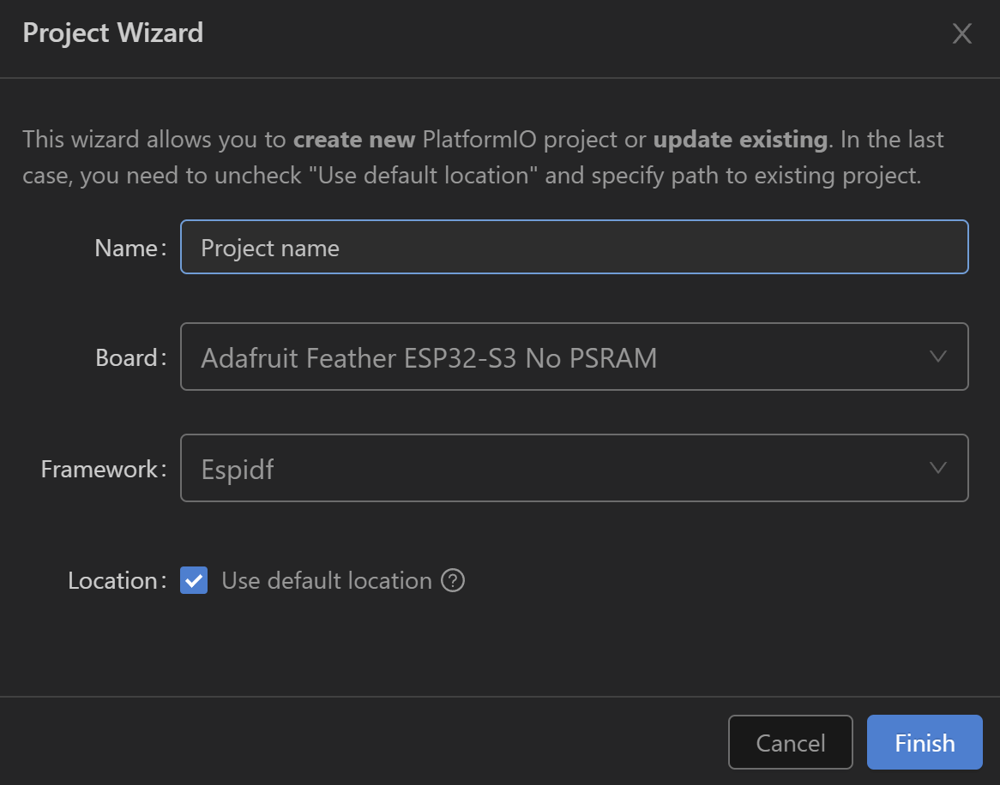

# MyHID

esp32-s3 usb hid触摸屏个人学习项目

## 0. roadmap

- [x] 实现usb hid触摸屏转串口
- [x] 实现按钮设计器
- [ ] 实机测试（目前只初步观察了数据包，似乎是正确的，还没有实机测试）
- [ ] 多边形检测代码正确性测试
- [ ] 实现上位机软件

## 1. 项目简介

该项目是本人用于学习usb、hid、esp32-s3的usb库调用的一个小项目，最终实现的功能是在esp32-s3上接入标准usb hid触摸屏后，通过在[button_designer](button_designer)内定义好的按钮，实现在点击触屏后，通过串口，发送对应的按钮数据包到主机。

你可以通过本项目：

- 学习到如何在esp32-s3上使用usb hid库，如何使用usb hid库发送数据包，如何使用usb hid库接收触摸屏数据包。

- 搭建一个简单的usb hid触摸屏转串口的设备。

为什么不直接把触摸屏连到电脑上？

- 用户在使用触摸屏直接操作某些设备时，如果系统没有做好防止越权的措施，可能让用户直接操作设备。通过本项目，发送给上位机的仅仅只是触控信息数据包，用户操作只会被特定的按钮区域响应。保障了设备的安全。

- windows的触控延迟非常大，如果是特殊需要较低延迟的应用，本项目通过直接处理数据包转成了串口，可以减少延迟。

## 2. 项目结构

[button_designer](button_designer) - 按钮设计器

[main.cpp](src/main.cpp) - 主程序

[platformio.ini](platformio.ini) - 项目配置文件


## 3. 项目依赖

- platformio-ide

  要编译该项目，需要安装[platformio-ide](https://platformio.org/platformio-ide)，并且需要安装esp32-s3的esp-idf开发环境。一般来说，安装好pio后打开本项目即可自动安装依赖。如果有问题，可以先试试按以下配置创建一个空项目看看是否成功，该步骤比较依赖网络，如果遇到长时间卡住，可以尝试重启vsc、电脑。
  
  

- esp32-s3 硬件(理论上支持usb的esp32都可以)

- 符合usb hid规范的触摸屏

- otg线

- 烙铁(选配)
  
  我的开发板如下图所示

  

  如果你的开发板和我的一样，这个开发板的背面有两个断开的焊盘，只有当焊接之后，otg接口（丝印usb）才是host模式（可以接入设备并对外供电），否则是和上位机通信的模式。

  **注意** 按照官方说法，一旦焊接，就不要通过这个口连接电脑等带有usb供电的设备，否则可能会损坏设备。

  焊接焊盘后，com口连接电脑，usb口连接otg线后连接触摸屏，即可开始调试。

## 4. 如何使用

1. 按钮数据装载

    1.1 打开[button_designer](button_designer)文件夹，打开index.html，你会看到一个示例，在右边`导入/导出` 输入框内粘贴以下内容，并点击`从json导入`

    ```json
    [{"x":-999,"y":-999},{"x":718,"y":955},{"x":31970,"y":1074},{"x":32049,"y":6864},{"x":638,"y":6685},{"x":638,"y":836},{"x":-999,"y":-999},{"x":11321,"y":13190},{"x":21924,"y":13250},{"x":21845,"y":16712},{"x":11321,"y":16831},{"x":11401,"y":13190},{"x":-999,"y":-999},{"x":4066,"y":17309},{"x":9248,"y":17309},{"x":9328,"y":21308},{"x":3907,"y":21367},{"x":3986,"y":17309},{"x":-999,"y":-999},{"x":23439,"y":17309},{"x":28701,"y":17309},{"x":28701,"y":21188},{"x":23439,"y":21248},{"x":23519,"y":17368},{"x":-999,"y":-999},{"x":4146,"y":24590},{"x":9328,"y":24590},{"x":9168,"y":28589}]
    ```

    该示例假设了一个工业设备的控制面板，通过点击按钮周围，可以创建一个按钮。实例中还有一个半按钮没有绘制完全，你可以尝试点击来体验。

    操作说明

    - 如果需要重置图片大小，需要刷新网页

    - `左键` 点击按钮周围，创建按钮的顶点

    - `n` 创建一个新的按钮

    - `d` 删除最后一个顶点

    - 按钮`转成json`，将按钮数据保存到右边的输入框内，以便后续导入或分享。

    - 按钮`从json导入`，将右边的输入框内的按钮数据导入到画布并创建c++代码

    - 按钮`复制`，将按钮数据复制到剪贴板

    **注意** 每个按钮需要是闭合图形，本人懒没有写（才不是因为不太会canvas），自己尽量保证闭合，即首个端点在最后一个端点附近。

    1.2 学会后准备一张你自己的按钮底图，重命名为`bg.png`，放到[button_designer](button_designer)文件夹内，刷新或重新打开`index.html`，开始绘制你的按钮。途中，你可以点击`转成json`，将按钮数据保存到右边的输入框内，以便后续导入或分享。

    1.3 当你绘制完毕，点击`复制`，将按钮数据粘贴到[`main.cpp`](src/main.cpp)的`customBehavior`.`触摸按钮定义`下方。

2. 自定义程序行为

    2.1 [`main.cpp`](src/main.cpp)的`customBehavior`中，你可以自定义各种程序的行为，你可以先体验一下我的示例然后在决定要不要自定义。除了`customBehavior`函数，其他基本不需要动。

    以下列出几个常用的自定义行为，可以在代码中查看注释

    - `serialDataMode` - 发送给上位机的串口数据格式

    - `buttonMode` - 按钮模式

    - `serialReceiveCallback` - 串口接收回调, 你可以在这里处理串口接收到的数据

3. 编译

    3.1 (选做) 如果你需要将esp32的com口固定为某个值，例如`com3`，右键开始菜单，选择`设备管理器`，找到`端口(COM和LPT)`，找到你的esp32设备，右键属性，找到`端口设置` `高级`，在`COM端口号`中选择你想要的端口号，点击`确定`。

    3.2 配置好pio后，在vscode打开本项目，点击左下角的`build(小对勾)`，等待编译完成。这一步的目的是先确定可以正常编译。

    **注意** 对于一些设备，comX是被占用的，你如果执意要固定到某个com口，例如我的上位机程序写死了com3，那么你需要确定当前系统中的com3是无关紧要的。你可以通过`设备管理器`顶上的`查看`，选择`显示隐藏设备`，然后在`端口(COM和LPT)`中查看是否有隐藏的comX，如果有，先确认他不重要，再把的属性中的com改为别的即可。一般情况下不会有太大问题。

    3.3 更改`platformio.ini`中的`upload_port`为你的esp32-s3的com口，点击左下角的`upload(右箭头)`，等待上传完成。

4. 测试

    将esp32-s3连接到电脑，打开串口调试工具，设置波特率为`9600`，打开串口，点击触摸屏，观察串口输出。

## 5. 可能存在的问题

- 屏幕方向与数据包

    我不是很了解usb hid触摸屏的数据包格式是否是统一的，并且我只有一个触摸屏，所以代码里面的数据包格式是按照我的屏幕来的。我的屏幕是横屏的，左上角为0，0，右下角为32767，32767。如果你的屏幕是竖屏的，可能需要调整数据包格式。你可以看到代码中的printf，解除之后在在下文的menuconfig中打开日志输出，观察数据包的格式，然后调整代码。

    如果你的数据格式和我一样，想要把屏幕转90度使用，请保证在`button_designer`中绘制的按钮数据是正确的，即你仍然需要做一张横屏的底图，但是内容是竖屏的。

- 触摸区域检测

    本项目使用了一个简单的判断某一点是否在多边形内的算法，如果你的按钮较多，不知道会不会出现错误。你可以在`main.cpp`中找到`isPointInShape`函数，将其替换为更加准确的算法。

## 6. menuconfig更改的项目

- 本项目的printf等输出已被重定向到串口1，并且没有初始化，你不能在直接连接到esp32-s3的串口0上看到输出，如果你希望调试程序，可以在`vscode最左侧栏`-`pio`-`*****esp32s3`-`platform`-`Run Menuconfig`中打开menuconfig找到日志输出，并选择uart0。

- 主线程的栈大小已扩展到8192，如果你的按钮较多，可以进一步扩展。

## 7. 授权

本项目仅为本人的学习项目，禁止将原始代码作为任何商用目的，遵循`CC-BY-NC-SA`协议，你可以在遵循该协议的前提下使用本项目的代码。

## 8. 参考代码

- [esp32 hid官方例程](https://github.com/espressif/esp-idf/blob/b5ac4fbdf9e9fb320bb0a98ee4fbaa18f8566f37/examples/peripherals/usb/host/hid/main/hid_host_example.c)